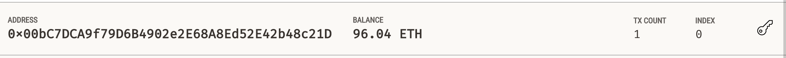

# Module 19 Challenge - Cryptocurrency Wallet


## Overview
For this challenge I assume the role of a blockchain lead developer working at the disruptive startup, KryptoJobs2Go. The company connects consumers with Fintech professionals that they can hire. I have been tasked with the completion and testing of code that enables the customers to send cryptocurrecy payments to fintech professionals utilizing Etherium blockchain technology. 

The application consists of two files:

1. [krypto_jobs.py](krypto_jobs.py) This is the primary file that contains the user interface for the application, compatible with the Streamlit library. 
   
2. [crypto_wallet.py](crypto_wallet.py) This is the secondary file that contains the Ethereum transaction functions that will be called upon by the primary file by way of import statements. 

[Ganache](https://archive.trufflesuite.com/ganache/), a development tool that simulates an Ethereum blockchain, was used to test the application and validate the results.

## Libraries and Dependencies
The krypto_jobs.py file loads the following libraries and dependencies.
```python
# Imports
import streamlit as st
from dataclasses import dataclass
from typing import Any, List
from web3 import Web3
```
The crypto_wallet.py file loads the following libraries and dependencies.
```python
# Imports
import os
import requests
from dotenv import load_dotenv

load_dotenv()
from bip44 import Wallet
from web3 import Account
from web3 import middleware
from web3.gas_strategies.time_based import medium_gas_price_strategy
```
## End-user Instructions
The application will require a development environment that has the afforementioned libraries installed. 

Once the files have been relocated to your local machine, the application can be run from a terminal window within your IDE (Visual Studio was used to develop the application) from the correct development environment containing the above, by typing the following command. 

```python
streamlit run krypto_jobs.py
```
## Application Results
Below are screenshots for the web application using Streamlit technology and the transaction validation in Ganache.

### Web application before transaction


### Ganache before transaction


### Web application sidebar after transaction


### Validated transaction hash from web application


### Ganache after transaction


### Ganache after transaction (zoomed)


### Ganache transaction tab


### Web application showing the chain validation
<small>(see `True` in bottom center of screenshot)</small>


### Chain validation zoomed in


### Close-up of expanded block inspector pulldown


## Sources
The following sources were consulted in the completion of this project. 

* [pandas.Pydata.org API Reference](https://pandas.pydata.org/docs/reference/index.html)
* [Streamlit Documentation](https://docs.streamlit.io/)
* UCB FinTech Bootcamp instructor-led coding exercises

## License
[MIT License](LICENSE)